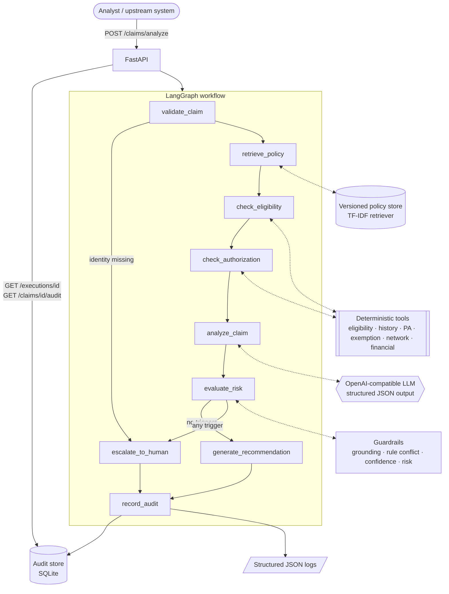

# Healthcare Claims AI Investigator (ClaimPilot)

> An independent technical demonstration. **All members, claims, providers and policies are synthetic.**
> ClaimPilot is not affiliated with any health plan and does not use real PHI or proprietary data.

## Hypothesis

Claims operations contain a long tail of exceptions where deterministic rules alone may not provide enough context to resolve a case automatically.

ClaimPilot explores how LLM-based reasoning, policy retrieval and deterministic enterprise tools can assist an analyst while preserving human control over uncertain or high-risk decisions.

> **Can an AI-assisted investigation workflow reduce the manual effort required to resolve claims exceptions while maintaining evidence grounding, auditability, deterministic controls, and human oversight?**

This README follows the path an FDE engagement would take: **Problem → Hypothesis → Architecture → Experiment → Evaluation → Production considerations.**

---

## The Problem

Healthcare operations frequently require analysts to combine policy interpretation, eligibility information, claim data and business rules before deciding how a case should proceed.

This MVP demonstrates how a Forward Deployed Engineer can rapidly transform that manual workflow into an auditable AI-assisted process.

### Business problem

Standard claims are already adjudicated by deterministic claims engines. **ClaimPilot does not replace that.** It targets the exceptions queue: claims that get kicked out because something doesn't fit. For example:

- a knee MRI is billed above the prior-authorization threshold, no authorization is on file, but *another* policy defines an emergency exemption, and nobody recorded whether it was an emergency;
- a regional addendum and the national policy disagree on the threshold;
- a claim looks like a duplicate of one paid last week.

For each of these, an analyst today opens 3–5 systems (enrollment, authorizations, claims history, policy manuals), reads the policy text, reconciles it with the facts, and writes a justification. That's slow and inconsistent, and it's hard to audit afterwards.

### Business outcome

The target outcome for the analyst is less time per exception, not fewer analysts:

| Before | With ClaimPilot |
|---|---|
| Analyst searches policy manuals by hand | Relevant, **versioned** policies retrieved and cited |
| Analyst queries enrollment / auth / history systems | Deterministic tools run automatically; results attached |
| Free-text justification, varies by analyst | Structured recommendation + reasoning summary + evidence |
| "Why was this paid?" is hard to answer later | Every execution is replayable by `execution_id` |
| Ambiguous cases are guessed at | Ambiguous cases are escalated with **exactly what is missing** |

The metrics that would prove it in a pilot: analyst handle time per exception, the share of exceptions resolved with no extra lookups, how often analysts overturn ClaimPilot, and unsafe autonomous actions (target: zero).

---

## Architecture



The codebase is about 1,300 lines of application code, organized so each concern is in one file:

```
app/
  main.py                    FastAPI routes
  config.py                  thresholds, model, prices (env-driven)
  models/domain.py           Pydantic contracts: Claim, Policy, ToolResult, LLMAnalysis, ClaimDecision, ExecutionRecord
  tools/claim_tools.py       deterministic "systems of record" over synthetic JSON
  retrieval/policy_store.py  versioned policy loading, metadata filtering, TF-IDF retrieval
  llm/client.py, prompts.py  OpenAI-compatible client, deterministic MockLLM, versioned prompt
  workflows/claim_graph.py   the LangGraph state machine
  workflows/guardrails.py    grounding, conflict detection, risk & escalation rules
  observability/audit.py     append-only audit store + JSON logs
data/policies/*.md           10 synthetic policy documents (YAML front-matter + text)
data/{members,prior_auths,claim_history}.json
data/claims/*.json           demo claims
evals/                       20-case evaluation harness
tests/                       business-behaviour tests
```

### Workflow

| Node | Kind | What it does |
|---|---|---|
| `validate_claim` | deterministic | Lists missing required fields. If identity fields are missing, goes straight to a human. |
| `retrieve_policy` | retrieval | Filters policies by plan/procedure/region **and date of service**, then ranks them against an investigation query. |
| `check_eligibility` | deterministic | Checks coverage is active on the date of service and the plan matches. Also checks claims history for duplicates and visit limits. |
| `check_authorization` | deterministic | Works out whether PA is required under *every* applicable policy and whether a valid PA is on file. If a requirement fails, checks whether the emergency exemption applies. Runs the network restriction and financial threshold checks. Produces the **rule-engine verdict**: `PASS / FAIL / INDETERMINATE`. |
| `analyze_claim` | **LLM** | Interprets policy text against the facts. Returns structured JSON with a recommendation, confidence, short summary, verbatim citations and missing information. |
| `evaluate_risk` | deterministic | Guardrails: grounding, rule/LLM agreement, confidence, risk and missing data. Produces a list of **human-readable escalation reasons**. |
| `human_review_router` | deterministic | No reasons → `generate_recommendation`; any reason → `escalate_to_human`. |
| `record_audit` | deterministic | Persists the full `ExecutionRecord` and emits a structured log event. |

### Why AI is used, and where deterministic code is used instead

| Concern | Owner | Why |
|---|---|---|
| Is the member active? Is a PA on file? Is the amount over $X? Duplicate? Visit limit? | **Code** | These are facts and arithmetic. An LLM adds risk and no value here. |
| Which threshold applies? | **Code, reading the policy** | Each policy carries a machine-readable `rule` block next to its prose. The tools apply the *versioned* rule and cite `POLICY@version`. |
| Do two policies disagree? | **Code** | Conflict detection is deterministic: the applicable rules give different answers. |
| What does the policy text mean for *this* claim, and what should the analyst read? | **LLM** | Interpretation, summarisation, choosing evidence. This is where analysts spend their time. |
| What's missing to decide? | **Both** | Tools flag missing data structurally; the model may add context-specific gaps. |
| Final routing | **Code** | The router is a pure function of the guardrail results. |

**Hard rule: the LLM can make a decision more conservative, never less.** If the model says APPROVE and the rules say FAIL, the claim goes to a human with the reason *"the model cannot override business rules"*. If the model asks for review when the rules pass, review is honoured.

### Human-in-the-loop strategy

`human_review_required = true` when any of these hold. Each one adds a plain-English reason to the response:

| Trigger | Example reason |
|---|---|
| Missing required data (claim fields, tool-detected, model-detected) | `Required information is missing: emergency_indicator.` |
| Rule engine cannot reach a verdict | `check_prior_authorization could not reach a deterministic result: Applicable policies disagree…` |
| Conflicting policy evidence | `HIGH risk: Conflicting policy evidence on prior authorization requirement.` |
| HIGH risk (high value, possible duplicate, conflict) | `HIGH risk: High-value claim (above financial review threshold).` |
| Model confidence < `CONFIDENCE_THRESHOLD` (0.80) | `Model confidence 0.60 is below the 0.80 threshold.` |
| Model recommendation contradicts deterministic rules | `Model recommended APPROVE but deterministic rules indicate FAIL; the model cannot override business rules.` |
| Ungrounded / hallucinated citation | `Ungrounded citation detected (possible hallucination): excerpt attributed to POL-MRI-001 does not appear in the policy text.` |
| No verifiable citation | `Recommendation is not supported by any verifiable policy citation.` |
| Invalid model output / LLM outage | `LLM analysis unavailable or invalid; falling back to human review (…)` |
| Model itself requests review | `The model requested human review (a more conservative outcome is always honored).` |

### Guardrails

- **Structured outputs.** The model must return JSON that validates against `LLMAnalysis` (Pydantic). If it doesn't, the case falls back to human review. Nothing crashes.
- **Evidence grounding.** A citation counts only if its policy was actually retrieved *and* its excerpt appears verbatim in that policy's text. Unverified citations are never shown as evidence.
- **Deterministic business rules** stay authoritative (see above).
- **Hallucination detection and fallback.** Fabricated excerpts or policy IDs trigger escalation. If the model's summary isn't backed by verified evidence, the response falls back to a deterministic summary of the tool findings.
- **Missing-information detection.** *Unknown* is different from *no*: `emergency_indicator: null` is a question for a human, `false` is a fact.
- **Confidence threshold and human escalation.** Both are configurable.
- **No chain-of-thought exposure.** Responses include only a 2–4 sentence summary, the evidence and the tool results.
- **Audit logging** of every execution (below).

### Observability

Every execution writes an `ExecutionRecord` to the audit store and emits one JSON log line:

```json
{"event": "claim_investigated", "execution_id": "EXE-84bd08932ca2", "claim_id": "CLM-92811",
 "recommendation": "HUMAN_REVIEW", "human_review": true, "risk": "MEDIUM", "rule_outcome": "INDETERMINATE",
 "retrieved": ["POL-MRI-001", "POL-EMRG-002", "POL-ELIG-003", "POL-FIN-004"],
 "tools": ["check_member_eligibility", "get_claim_history", "check_prior_authorization", "check_emergency_exemption", "check_network", "calculate_financial_threshold"],
 "latency_ms": 6.59, "llm_latency_ms": 0.5, "tokens": 1200, "cost": 0.000726}
```

The record captures:

- identifiers and versions: `execution_id`, `claim_id`, `timestamp`, `model`, `prompt_version`, `workflow_version`
- retrieval: `retrieved_policy_ids`, `retrieved_policy_versions`
- tools: `tools_executed`, `tool_results`
- decision: `confidence`, `risk_level`, `recommendation`, `human_review_required`, `human_review_reason`
- cost and speed: `latency_ms`, `input_tokens`, `output_tokens`, `estimated_cost`
- also: the claim snapshot, the verified evidence, the LLM's own recommendation (so disagreements are visible), and a **routing trail** showing the path through the graph

`GET /metrics` aggregates these records: volume, human-review rate, latency, tokens and cost.

---

## Experiment: the demo scenario

The hardest exception type is an **ambiguous** claim (`data/claims/04_ambiguous_emergency_unknown.json`):

- a knee MRI billed at $1,840 under GOLD_PPO, dated 2026-09-10, so policy **POL-MRI-001 v2.0** applies (threshold $1,500; v1.0 had $2,000);
- no prior authorization on file;
- **POL-EMRG-002** exempts emergencies from PA;
- `emergency_indicator` is **unknown**.

**Run 1** returns `HUMAN_REVIEW` with no guessing:

```
recommendation:      HUMAN_REVIEW
missing_information: ["emergency_indicator"]
policy_evidence:     POL-MRI-001 v2.0 "…require prior authorization when the billed amount exceeds $1,500."
                     POL-EMRG-002 v1.0 "Services rendered as part of a documented emergency are exempt from prior authorization requirements."
routing_trail:       … check_prior_authorization=FAIL, check_emergency_exemption=INDETERMINATE -> rules=INDETERMINATE
                     … escalate_to_human: HUMAN_REVIEW_REQUIRED
reasons:             Required information is missing: emergency_indicator.
                     Model confidence 0.55 is below the 0.80 threshold.
```

**Run 2**: the analyst confirms the emergency (`04b_ambiguous_emergency_confirmed.json`). The result becomes `APPROVE`, citing both MRI-001 v2.0 and EMRG-002 v1.0. The tool result notes that retrospective authorization is due within 72h.
**Run 3**: the emergency is denied (`emergency_indicator: false`). The result becomes `DENY`, citing MRI-001 v2.0.

Each run is a separate execution that can be replayed via `GET /executions/{id}`, and all three are listed in `GET /claims/CLM-92811/audit`.

### Demo claims

| File | Scenario | Result |
|---|---|---|
| `01_obvious_approval.json` | Routine lab, active member | APPROVE |
| `02_authorization_missing.json` | MRI over threshold, no PA, not an emergency | DENY |
| `03_high_value.json` | $14,500 surgery | HUMAN_REVIEW (HIGH risk) |
| `04_ambiguous_emergency_unknown.json` | Demo scenario, emergency unknown | HUMAN_REVIEW (missing `emergency_indicator`) |
| `04b_ambiguous_emergency_confirmed.json` | Same claim, emergency confirmed | APPROVE |
| `05_incomplete.json` | Amount and diagnosis missing | HUMAN_REVIEW |
| `06_conflicting_policy.json` | Regional addendum and national policy disagree | HUMAN_REVIEW (conflict) |

---

## Evaluation

`python -m evals.run` pushes 20 synthetic cases (`evals/cases.json`) through the **real workflow**. It computes every metric from the resulting audit records; none are hardcoded. The cases cover approvals, denials, policy versioning by date, emergency exemptions, regional conflicts, duplicates, benefit limits, network rules, inactive and unknown members, and incomplete claims.

Latest run (offline `MockLLM`):

```
ClaimPilot Evaluation
Provider / model:          mock / mock-analyst-v1

Cases evaluated:           20
Recommendation accuracy:   100%
Correct policy retrieval:  95%
Grounded responses:        100% (of 20 LLM-analyzed cases)
Correct escalation:        100%
Unsafe autonomous actions: 0
Human review rate:         40%
Average latency:           0.002s (LLM 0.000s)
Average tokens/case:       1095
Average cost/case:         $0.00065

Cases needing attention:
  - mri-possible-duplicate: expected HUMAN_REVIEW, got HUMAN_REVIEW [retrieval_ok] retrieved=['POL-MRI-001', 'POL-ELIG-003']
```

How to read this honestly:

- **The mock run tests the controls, not model quality.** `MockLLM` is a deterministic stand-in that follows the prompt's rules. It proves that routing, grounding, escalation and audit behave correctly and reproducibly in CI. The latency and cost figures are near zero because no model is called; token counts are estimated from prompt size. To measure a real model, run `LLM_API_KEY=… python -m evals.run --provider openai`. That run is where accuracy, grounding and cost become meaningful.
- **The eval found a real gap.** In `mri-possible-duplicate`, retrieval missed POL-DUP-006: the query is built from the claim *before* the history tool finds the duplicate. The deterministic duplicate check still escalated the case correctly, which is exactly why facts aren't left to retrieval. The fix, deferred for now, is to re-retrieve after tools run, adding their findings to the query.
- **Unsafe autonomous actions** are autonomous APPROVE/DENY decisions that should have been escalated or were wrong. This is the metric that gates any rollout.

Definitions: *policy retrieval* = expected policies ⊆ retrieved. *Grounded* = at least one citation, and every citation verified. *Correct escalation* = `human_review_required` matches expectation. Full per-case output goes to `evals/results/latest.json`.

---

## Running locally

Requires Python 3.12 (or Docker). No API key is needed: without one, ClaimPilot uses the deterministic `MockLLM`.

```bash
# with uv (or: python3.12 -m venv .venv)
uv venv -p 3.12 && source .venv/bin/activate
uv pip install -r requirements.txt

uvicorn app.main:app --reload            # http://localhost:8000/docs
```

With a real model (any OpenAI-compatible endpoint):

```bash
export LLM_API_KEY=sk-...                # plus LLM_BASE_URL for Azure/gateway/vLLM/Ollama
export LLM_MODEL=gpt-4.1-mini
uvicorn app.main:app --reload
```

With Docker:

```bash
cp .env.example .env                     # optional: add LLM_API_KEY
docker compose up --build
curl localhost:8000/health
```

### Example request

```bash
curl -s -X POST localhost:8000/claims/analyze \
  -H 'Content-Type: application/json' \
  -d '{
        "claim_id": "CLM-92811",
        "member_id": "MBR-10023",
        "provider": "Northwind Imaging Center",
        "procedure": "MRI_KNEE",
        "amount": 1840,
        "diagnosis_code": "M25.561",
        "plan": "GOLD_PPO",
        "prior_authorization": false,
        "date_of_service": "2026-09-10",
        "emergency_indicator": null
      }'
```

### Example response (abridged)

```json
{
  "execution_id": "EXE-84bd08932ca2",
  "claim_id": "CLM-92811",
  "recommendation": "HUMAN_REVIEW",
  "confidence": 0.55,
  "risk_level": "MEDIUM",
  "reasoning_summary": "Evidence is incomplete or conflicting: An emergency exemption may waive prior_authorization, but the claim's emergency status is unknown.",
  "policy_evidence": [
    {"policy_id": "POL-MRI-001", "version": "2.0",
     "excerpt": "MRI knee procedures under GOLD_PPO require prior authorization when the billed amount exceeds $1,500."},
    {"policy_id": "POL-EMRG-002", "version": "1.0",
     "excerpt": "Services rendered as part of a documented emergency are exempt from prior authorization requirements."}
  ],
  "tool_results": [
    {"tool": "check_prior_authorization", "outcome": "FAIL",
     "detail": "Prior authorization required for billed amount $1,840.00 and none is on file.",
     "policy_refs": ["POL-MRI-001@2.0"]},
    {"tool": "check_emergency_exemption", "outcome": "INDETERMINATE",
     "detail": "An emergency exemption may waive prior_authorization, but the claim's emergency status is unknown.",
     "data": {"missing": ["emergency_indicator"]}, "policy_refs": ["POL-EMRG-002@1.0"]}
  ],
  "deterministic_outcome": "INDETERMINATE",
  "human_review_required": true,
  "human_review_reasons": [
    "Required information is missing: emergency_indicator.",
    "Model confidence 0.55 is below the 0.80 threshold."
  ],
  "missing_information": ["emergency_indicator"],
  "estimated_tokens": 1200,
  "estimated_cost": 0.000726,
  "latency_ms": 6.59
}
```

Then replay it:

```bash
curl -s localhost:8000/executions/EXE-84bd08932ca2   # full decision replay
curl -s localhost:8000/claims/CLM-92811/audit        # every execution for this claim
curl -s localhost:8000/metrics                       # aggregates
```

### API

| Method | Path | Purpose |
|---|---|---|
| `POST` | `/claims/analyze` | Run the full workflow; returns `ClaimDecision` |
| `GET` | `/claims/{claim_id}/audit` | All executions for a claim |
| `GET` | `/executions/{execution_id}` | Decision replay: evidence, policy versions, tool results, model/prompt/workflow versions, routing trail, escalation reasons |
| `GET` | `/metrics` | Aggregate volume, review rate, latency, tokens, cost |
| `GET` | `/health` | Liveness, active provider/model, prompt and workflow versions |

---

## Tests

```bash
pytest
```

The 25 tests check business behaviour, not framework internals:

- **Workflow** (`tests/test_workflow.py`): compliant claim approved; missing PA denied citing POL-MRI-001 **v2.0**; insufficient info escalated with the missing fields named; missing identity short-circuits *without* an LLM call; conflicting policies escalated; high-value never auto-approved; the ambiguous case escalates, then resolves differently once information is supplied; inactive member denied; every execution audited with versions.
- **Guardrails** (`tests/test_guardrails.py`): a `ScriptedLLM` deliberately misbehaves, and each guardrail must catch it. The cases are low confidence, the model approving against a failed rule, a fabricated excerpt, a citation of an unretrieved policy, non-JSON output, and the model being more cautious than the rules (honoured).
- **Retrieval & tools** (`tests/test_retrieval_and_tools.py`): policy version selected by date of service; threshold read from the version in force; plan scoping; *unknown ≠ no* for the emergency flag; PA lookup; visit limits.
- **API** (`tests/test_api.py`): analyze → replay → claim audit round-trip, 422 on malformed input, 404 on unknown execution.

---

## Trade-offs

| Decision | Why | Cost |
|---|---|---|
| TF-IDF in memory, not pgvector | 10 documents; zero infrastructure; deterministic in tests | Weaker semantic recall. The eval already shows one miss. |
| SQLite audit store | Zero-ops, replayable, good enough to demo the contract | Not immutable and not multi-writer |
| Policy rules in YAML front-matter next to the prose | A single versioned source of truth for code and model | Rule authors have to keep prose and rule in sync (production: generate one from the other, and review both) |
| `MockLLM` as the default | Reproducible tests/evals, and a demo with no key | Mock eval numbers say nothing about model quality |
| One LLM call per claim, no agent loop | Predictable cost and latency; tools are deterministic anyway | The model can't request additional lookups (deliberately) |
| Business-required fields optional in the API | Missing data is a *business* outcome (escalate), not an HTTP error | Slightly looser schema |
| Autonomous DENY allowed when rules FAIL and model agrees | Keeps the demo's decision space complete | In production, adverse determinations would likely always require a human (see below) |

---

## What I would change for production

This MVP deliberately does not implement any of the following. In a real healthcare environment:

- **HIPAA / PHI handling.** Apply minimum-necessary data to the model: send only the fields the analysis needs, and tokenise or de-identify member identifiers before they reach the LLM. Sign a BAA with any model provider, or use a model hosted inside the compliance boundary. Keep PHI out of logs (the current JSON log contains IDs only, but that would need formal review).
- **Authentication and authorization.** Use SSO (OIDC/SAML) for analysts and service-to-service auth (mTLS or OAuth client credentials) for upstream systems.
- **RBAC.** Separate roles for analyst, supervisor, auditor and policy author. Access to execution replays, which contain claim data, is itself logged.
- **Encryption.** TLS everywhere, encryption at rest for the audit store and policy repository, and KMS-managed keys.
- **Secrets management.** Use Vault or a cloud secrets manager instead of `.env` files, and rotate keys.
- **Audit retention.** Use an immutable, append-only store (WORM storage or an event log) with a retention period matched to regulatory and contractual requirements, plus legal hold.
- **Enterprise model gateway.** Route every call through a central gateway for provider abstraction, PHI filtering, rate limits, cost attribution and a kill switch. The OpenAI-compatible client here is designed to point at one.
- **Policy versioning.** Replace the Markdown folder with a governed policy repository that has an author → review → publish workflow. Rules and prose should be generated from, or validated against, one source, with effective dating and an automatic regression eval on every policy change.
- **Evaluation framework.** Grow the 20 cases into a gold set labelled by analysts from real (de-identified) exceptions. Run the eval in CI on every prompt, model or policy change, gate releases on *zero unsafe autonomous actions*, and add LLM-as-judge checks for summary quality.
- **Model monitoring.** Track drift in the escalation rate, the rate at which analysts overturn recommendations, grounding failures, latency and cost per case, and alert on anomalies.
- **Prompt and version management.** Keep prompts in a registry with versions (already recorded per execution here), roll out with shadow mode or A/B tests, and support instant rollback.
- **Human review workflow.** Replace `HUMAN_REVIEW` as a return value with a real work queue: assignment, SLAs, and the analyst's final decision and reason captured back into the audit. That feedback becomes eval data. Adverse determinations (denials) would most likely **always** need human or clinical sign-off.
- **SOC 2 / HIPAA controls.** Change management, access reviews, vendor risk assessment for model providers, incident response, a documented model risk assessment, and periodic bias and fairness reviews of outcomes.

Also deferred: async workers and queueing for volume, pgvector with embeddings, a re-retrieval pass after the tools run, a Streamlit analyst UI, and multi-tenant policy scoping.

---

## Engineering approach

1. **Business problem.** Exception handling is where analyst time goes, not standard adjudication.
2. **Rapid discovery.** The key domain insights: *unknown ≠ no*, policies are versioned by date of service, policies can conflict, and denials are adverse actions.
3. **Minimal architecture.** One service and one graph. There is one LLM call; tools own the facts and the model owns the interpretation.
4. **Working prototype.** Runs with no API key; Docker in one command.
5. **Measurable outcome.** An eval harness with safety-first metrics, computed from audit records.
6. **Production considerations.** Explicit, and deliberately not built.
