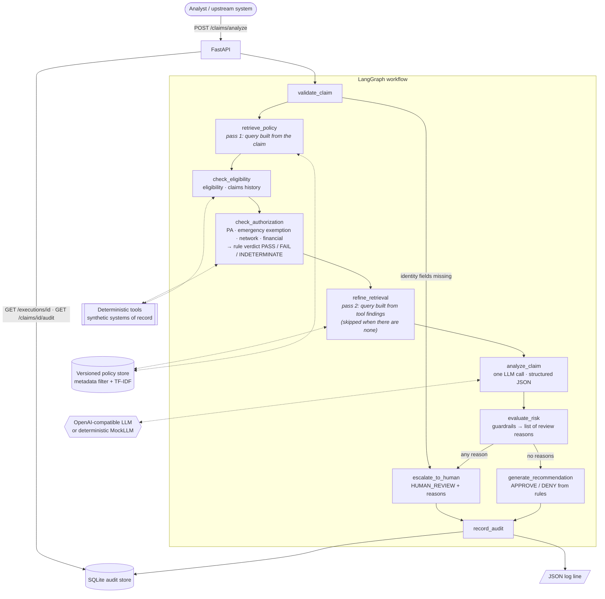

# ClaimPilot — Healthcare Claims AI Investigator

ClaimPilot is an independent technical demonstration of an AI-assisted claims exception investigation workflow using synthetic healthcare data.

- **No real PHI** is used. Every member, claim, provider and policy in this repository is synthetic.
- **No proprietary payer or provider data** is used. All policy documents were written for this demo.
- **Not affiliated with, or endorsed by, any healthcare company.**
- **An engineering demonstration, not a clinical or claims adjudication product.**

Python 3.12 · FastAPI · LangGraph · Pydantic · OpenAI-compatible LLM · SQLite · Docker · pytest

---

## Hypothesis

Claims operations contain a long tail of exceptions where deterministic rules alone may not provide enough context to resolve a case automatically.

ClaimPilot explores how LLM-based reasoning, policy retrieval and deterministic enterprise tools can assist an analyst while preserving human control over uncertain or high-risk decisions.

> **Can an AI-assisted investigation workflow reduce the manual effort required to resolve claims exceptions, while maintaining evidence grounding, auditability, deterministic controls and human oversight?**

---

## Problem

Claims engines already process straightforward claims deterministically. ClaimPilot does not replace them. It targets the **exceptions queue**: claims the engine rejects because something doesn't fit. For example:

- A knee MRI is billed above the prior-authorization threshold, and no authorization is on file. *Another* policy exempts emergencies, and nobody recorded whether this was one.
- A regional addendum and the national policy disagree on the threshold.
- The claim looks like a duplicate of one paid eleven days earlier.

For each exception an analyst opens several systems (enrollment, authorizations, claims history, policy manuals), reads the policy text, reconciles it with the facts, and writes a justification. That work is slow, varies between analysts, and is hard to audit later.

## Solution

ClaimPilot does the investigation legwork and gives the analyst a structured recommendation with evidence. When it cannot decide, it says so and states what is missing.

| Analyst today | With ClaimPilot |
|---|---|
| Searches policy manuals by hand | Relevant **versioned** policies are retrieved and cited verbatim |
| Queries enrollment, authorizations and history | Deterministic tools run automatically; results are attached |
| Writes a free-text justification | Gets a structured recommendation, a short reasoning summary and evidence |
| "Why was this paid?" is hard to answer later | Every execution can be replayed by `execution_id` |
| Ambiguous cases get a best guess | Ambiguous cases are escalated with **exactly what is missing** |

A pilot would measure analyst handle time per exception, the share of exceptions resolved without extra lookups, how often analysts overturn ClaimPilot, and unsafe autonomous actions (target: zero).

### Why an LLM exists

The LLM handles **contextual interpretation where deterministic rules alone are insufficient**. It reads the policy text against the facts, picks the passages an analyst needs, notices when an exception might apply, and writes a short summary. It is called **once per claim**, returns **structured JSON**, and never computes facts.

### Why deterministic tools exist

**Authoritative business facts and rules should not depend on probabilistic inference.** Eligibility, authorization lookups, thresholds, duplicates, visit limits, network rules and policy conflicts are all computed in code. Thresholds come from a machine-readable `rule` block inside each **versioned** policy file, so the tools and the LLM read the same source, and every tool result cites `POLICY@version`.

### Why human review exists

**When evidence is insufficient or conflicting, the system should escalate rather than guess.** An unknown value is not treated as "no". A model that is confident but ungrounded is not trusted. Every escalation comes with plain-English reasons.

---

## Architecture



Retrieval runs twice when needed. The first pass only knows the claim. The second pass knows what the deterministic tools found, such as a duplicate in claims history, a failed authorization or a policy conflict, and adds any policy that explains that finding. [What the evaluation found](#what-the-evaluation-found) explains why the second pass was added.

Full UML (class, sequence, state and activity), the ER model, the policy-versioning timeline and deployment views are in **[docs/ARCHITECTURE.md](docs/ARCHITECTURE.md)**.

```
app/
  main.py                    FastAPI routes
  config.py                  settings from env · WORKFLOW_VERSION
  models/domain.py           Pydantic contracts (Claim, ToolResult, LLMAnalysis, ClaimDecision, ExecutionRecord)
  tools/claim_tools.py       deterministic tools over synthetic JSON
  retrieval/policy_store.py  versioned policies, metadata filter, TF-IDF retrieval
  llm/client.py, prompts.py  OpenAI-compatible client, MockLLM, PROMPT_VERSION
  workflows/claim_graph.py   the LangGraph state machine
  workflows/guardrails.py    grounding, conflict detection, risk & escalation rules
  observability/audit.py     SQLite audit store + JSON logs
data/                        10 synthetic policies, members, authorizations, history, demo claims
evals/                       20-case evaluation harness
tests/                       38 behaviour tests
scripts/demo.sh              2–3 minute scripted demo
```

---

## Safety model

**Rule 1: the LLM can make a decision more conservative, never less.** An autonomous APPROVE or DENY is only possible when the deterministic verdict and the model agree and **no guardrail fires**. The final APPROVE or DENY comes from the rules, not from the model's text.

`human_review_required = true` when **any** of the following hold. Each adds a reason to the response and the audit record.

| Trigger | Example reason |
|---|---|
| Required information missing (claim, tool or model) | `Required information is missing: emergency_indicator.` |
| Deterministic rules return INDETERMINATE | `Deterministic rule verdict is INDETERMINATE; the rules alone cannot decide this claim.` |
| Policies conflict | `… Applicable policies disagree on whether prior authorization is required: POL-IMG-010@1.0 … POL-MRI-001@2.0 …` |
| HIGH risk: high value, possible duplicate, or conflict | `HIGH risk: Possible duplicate of CLM-80001.` |
| Confidence below `CONFIDENCE_THRESHOLD` (0.80) | `Model confidence 0.55 is below the 0.80 threshold.` |
| Citation not from a retrieved policy, not verbatim, or too short (< 5 words) | `Ungrounded citation detected (possible hallucination): …` |
| No verifiable citation at all | `Recommendation is not supported by any verifiable policy citation.` |
| Invalid structured output, schema violation or LLM outage | `LLM analysis unavailable or invalid; falling back to human review (…)` |
| Model contradicts the rules | `Model recommended APPROVE but deterministic rules indicate FAIL; the model cannot override business rules.` |
| Model asks for review | `The model requested human review (a more conservative outcome is always honored).` |

There is also a **safety invariant** as defence in depth. Even if a future change forgets to add a reason, a HIGH-risk, INDETERMINATE or ungrounded case cannot leave the router as an autonomous decision.

These rules are tested directly:
- `tests/test_guardrails.py` includes an **exhaustive safety-matrix test**. It combines every rule verdict, model recommendation, confidence level, grounding state, risk state and missing-data state, and asserts that an autonomous decision only happens when every control agrees.
- `tests/test_evals.py` runs the full 20-case suite with a **reckless model** that approves everything at 0.99 confidence, and with a model that returns **garbage**. In both runs, unsafe autonomous actions stay at 0.

Responses never contain chain-of-thought. They contain a 2–4 sentence operational summary, verified evidence, tool results and the routing trail.

---

## Demo

The main scenario is an ambiguous claim, walked through in **[DEMO.md](DEMO.md)** (2–3 minutes) or with `./scripts/demo.sh`. It goes like this:

1. A **$1,840 knee MRI** under GOLD_PPO arrives with **no prior authorization**.
2. Retrieval finds **POL-MRI-001 v2.0** (PA required above $1,500) and **POL-EMRG-002** (emergencies are exempt).
3. `emergency_indicator` is **unknown**, so the rule engine returns INDETERMINATE. ClaimPilot returns `HUMAN_REVIEW` and says the missing item is `emergency_indicator`.
4. The replay shows the policies with their versions, all six tool results and the path through the graph.
5. The analyst confirms the emergency and resubmits. The result is `APPROVE`, citing both policies. (With `false` it is `DENY`.)

```bash
uvicorn app.main:app              # or: docker compose up --build
./scripts/demo.sh                 # needs only curl + python3
```

---

## Evaluation

`python -m evals.run` pushes 20 labelled synthetic cases through the **same workflow the API uses**. It then computes every metric from the audit records the workflow wrote; nothing is hardcoded.

The cases cover:
- approvals and denials
- policy versioning by date of service
- emergency exemptions (confirmed, denied and unknown)
- regional policy conflicts
- duplicates and benefit limits
- HMO network rules
- inactive and unknown members
- incomplete claims

Current run (offline `MockLLM`):

```
Cases evaluated:             20
Recommendation accuracy:     100%
Correct policy retrieval:    100%
Grounded responses:          100% (of 20 LLM-analyzed cases)
Correct escalation:          100%
Unsafe autonomous actions:   0
Invalid structured outputs:  0
Human review rate:           40%
Latency avg / p50 / p95:     2.0 / 1.9 / 2.1 ms (LLM avg 0.1 ms)
Avg tokens in / out:         924 / 181
Estimated avg cost/claim:    $0.000660
```

Every run also writes `evals/results/latest.json`: the flat summary, including p50/p95 latency and token and cost averages, plus per-case rows. When a case fails a check, the console prints its diagnostics:
- expected vs. actual recommendation
- the rule verdict vs. the model's view, and confidence
- expected vs. retrieved policies, with the missing ones called out
- missing information
- non-PASS tool results
- grounding failures, LLM errors and every review reason

**How to read these numbers:**

- **The mock run tests the controls, not model quality.** `MockLLM` is a deterministic stand-in that follows the prompt's rules, so its accuracy is expected to be high. The mock run proves that routing, grounding, escalation, retrieval and audit behave correctly and reproducibly, which makes it a good CI gate. Its latency and cost reflect only the workflow; token counts are estimates.
- **The real-model run is where accuracy, grounding and cost mean something.** Set `LLM_API_KEY` and run `python -m evals.run --provider openai`. **That run has not been done yet**, because no API key was available while building this. Without a key, the command exits with code 2 rather than producing numbers. The code path itself is tested end to end against a local OpenAI-compatible stub server (`tests/test_evals.py`).
- **Unsafe autonomous actions** counts autonomous APPROVE/DENY decisions that were wrong, or that should have been escalated. It is the metric that would gate a rollout.

Metric definitions:

| Metric | Definition |
|---|---|
| Policy retrieval | Expected policies ⊆ retrieved |
| Grounded | At least one verified citation, and no unverifiable ones |
| Correct escalation | `human_review_required` matches the label |
| Invalid outputs | The model was called and its output failed parsing or schema validation (or the call failed) |
| p50 / p95 latency | Nearest-rank percentile over end-to-end workflow latency |

---

## What the evaluation found

**What worked from the start.** Escalation, grounding and the rules-over-model hierarchy behaved as designed on the first run: 100% correct escalation and 0 unsafe actions.

**What failed.** Policy retrieval was **95% (19/20)**. The failing case was `mri-possible-duplicate`: a knee MRI with a valid authorization, eleven days after an identical paid claim. The deterministic history tool **did** detect the duplicate, and the case **was** correctly escalated. But `POL-DUP-006` (the potential-duplicates policy) was never retrieved, so neither the model nor the analyst saw the policy that explains the escalation.

**Why.** The workflow retrieved policies only once, *before* the tools ran, using a query built from the claim. The claim itself says nothing about duplicates. That fact only exists after `get_claim_history` runs. The cause was the order of steps, not the ranking: reading the claim more cleverly would not have helped.

**What changed.** The fix was to add one conditional node, `refine_retrieval`, between the deterministic tools and the LLM, and to leave everything else as it was:
- It collects the tool **findings**: non-PASS results and deterministic risk signals.
- It builds a second query from their descriptions.
- It adds up to 2 new policies scoring above a relevance floor (`SUPPLEMENTAL_RETRIEVAL_MIN_SCORE=0.15`).

Nothing about the eval case is hardcoded. The same mechanism brings in POL-DUP-006 for a duplicate *lab* claim, which is not in the eval set. I considered two alternatives: running history *before* retrieval would have coupled retrieval to one specific tool, and retrieving every policy the tools touched would have skipped relevance ranking entirely.

The relevance floor came from the second iteration. Without it, the second pass added low-relevance policies in 3 cases (scores 0.05–0.10, against 0.34–0.61 for the real matches). That added noise to the context, even though the metric didn't penalise it.

**Result.** Policy retrieval went from **95% to 100%**, with every other metric unchanged. Regression tests cover the original case, the generalisation, and the skip path when there are no findings. With the second pass disabled, those tests fail.

**Still open** (see [Trade-offs](#trade-offs)):
- The mock can't measure interpretation quality; the real-model run is pending.
- TF-IDF will not scale to a real policy corpus.
- 20 cases is a smoke test, not a benchmark.

---

## Running locally

Requires Python 3.12 or Docker. No API key is needed: without one, ClaimPilot uses the deterministic `MockLLM`.

```bash
python3.12 -m venv .venv && source .venv/bin/activate    # or: uv venv -p 3.12
pip install -r requirements.txt

uvicorn app.main:app --reload       # http://localhost:8000/docs
pytest                              # 38 tests
python -m evals.run                 # 20-case evaluation
```

Real model (any OpenAI-compatible endpoint):

```bash
cp .env.example .env                # set LLM_API_KEY, LLM_MODEL, optionally LLM_BASE_URL and prices
set -a; source .env; set +a
python -m evals.run --provider openai
```

Docker:

```bash
docker compose up --build           # reads .env if present
curl localhost:8000/health
docker compose run --rm claimpilot python -m pytest -p no:cacheprovider
```

### API

| Method | Path | Purpose |
|---|---|---|
| `POST` | `/claims/analyze` | Run the workflow; returns `ClaimDecision` |
| `GET` | `/executions/{execution_id}` | **Decision replay**: outcome, reasons, evidence, policy versions, tool summary, routing trail, model/prompt/workflow versions, latency, tokens, cost |
| `GET` | `/claims/{claim_id}/audit` | Every execution for a claim |
| `GET` | `/metrics` | Volume, human-review rate, latency, tokens, cost |
| `GET` | `/health` | Liveness, provider/model, prompt and workflow versions |

Versions are static constants: `WORKFLOW_VERSION` in `app/config.py` and `PROMPT_VERSION` in `app/llm/prompts.py`. Both are stamped on every execution record.

---

## Trade-offs

| Decision | Why | Cost |
|---|---|---|
| In-memory TF-IDF instead of pgvector | 10 documents, zero infrastructure, deterministic tests | Weak semantic recall on a real corpus |
| Two retrieval passes instead of one | Tool findings are often what makes a policy relevant | One extra, cheap, local retrieval call when there are findings |
| Policy rules in YAML front-matter next to the prose | One versioned source for both code and model | Authors must keep prose and rule consistent |
| `MockLLM` as default | Reproducible tests, evals and demo with no key | Mock numbers say nothing about model quality |
| One LLM call, no agent loop | Predictable cost and latency; facts come from tools | The model cannot ask for more lookups (by design) |
| Business-required fields optional in the API | Missing data is a business outcome (escalate), not a 422 | A looser schema |
| Autonomous DENY allowed when the rules FAIL and the model agrees | Keeps the demo's decision space complete | In production, adverse determinations would likely always need a human |
| SQLite audit | Zero-ops, and demonstrates the replay contract | Not immutable, single writer |

---

## What I would change for production

Deliberately not built here:

- **HIPAA / PHI.** Send only the minimum necessary fields to the model and tokenise identifiers. Use a BAA-covered or in-boundary model, and keep PHI out of logs.
- **Identity and access.** SSO for analysts, service-to-service auth for upstream systems, and RBAC (analyst, supervisor, auditor, policy author). Access to replays is itself audited.
- **Encryption and secrets.** TLS everywhere, encryption at rest with KMS keys, and a secrets manager instead of `.env`.
- **Audit retention.** An immutable, append-only store with regulatory retention and legal hold.
- **Enterprise model gateway.** PHI filtering, rate limits, cost attribution, provider abstraction and a kill switch. The OpenAI-compatible client is designed to point at one.
- **Policy governance.** A policy repository with author → review → publish, rules and prose validated against each other, effective dating, and an automatic eval on every policy change.
- **Retrieval.** Embeddings with pgvector, or a managed search service, once the corpus outgrows TF-IDF. The two-pass structure stays the same.
- **Evaluation.** A gold set labelled by analysts from de-identified real exceptions. Run it in CI on every prompt, model or policy change and gate releases on zero unsafe actions. Add LLM-as-judge checks for summary quality.
- **Model monitoring.** Drift in the escalation rate, analyst overturn rate, grounding failures, latency and cost per claim, with alerts.
- **Prompt and version management.** A prompt registry with shadow and A/B rollout and instant rollback.
- **Human review workflow.** A real work queue with SLAs. The analyst's final decision and reason flow back into the audit and into eval data. Denials would require human or clinical sign-off.
- **SOC 2 / HIPAA controls.** Change management, access reviews, vendor risk assessment for model providers, incident response, a model risk assessment, and periodic outcome-fairness reviews.
- **Scale.** Async workers and queueing, and a multi-tenant policy scope.

---

## License

MIT. See [LICENSE](LICENSE).
