# ClaimPilot — Architecture & Design Documentation

This document describes how ClaimPilot is built, using UML and Mermaid diagrams. Every diagram matches the code in this repository; file references are given so each one can be checked.

| # | Diagram | Type | Question it answers |
|---|---|---|---|
| 1 | [System context](#1-system-context) | C4-style context | Who uses ClaimPilot and what does it depend on? |
| 2 | [Component view](#2-component-view) | UML component (flowchart) | What are the modules and how do they depend on each other? |
| 3 | [Domain model](#3-domain-model-uml-class-diagram) | UML class | What are the data contracts? |
| 4 | [Service classes](#4-service-classes-uml-class-diagram) | UML class | Which classes do the work, and through which interfaces? |
| 5 | [Workflow state machine](#5-workflow-state-machine-langgraph) | UML state | What path can a claim take? |
| 6 | [Analyze request](#6-analyze-request-uml-sequence) | UML sequence | What happens during `POST /claims/analyze`? |
| 7 | [Rule engine](#7-deterministic-rule-engine-uml-activity) | UML activity | How is the deterministic verdict computed? |
| 8 | [Escalation decision](#8-guardrails--escalation-decision-uml-activity) | UML activity | Why does a case go to a human? |
| 9 | [Ambiguous claim lifecycle](#9-ambiguous-claim-lifecycle-uml-sequence) | UML sequence | What happens when an analyst supplies the missing data? |
| 10 | [Decision replay](#10-decision-replay-uml-sequence) | UML sequence | How is a past decision reconstructed? |
| 11 | [Policy versioning](#11-policy-versioning-timeline) | Gantt | Which policy version applies on which date? |
| 12 | [Data model](#12-data-model-er) | ER | How are policies, reference data and audit records structured? |
| 13 | [Deployment](#13-deployment-view) | UML deployment (flowchart) | How does it run, today and in production? |
| 14 | [Evaluation pipeline](#14-evaluation-pipeline) | Flowchart | How are the quality metrics produced? |

---

## 1. System context

ClaimPilot sits **beside** the claims adjudication engine, not in place of it. It only sees the exceptions the engine could not resolve.

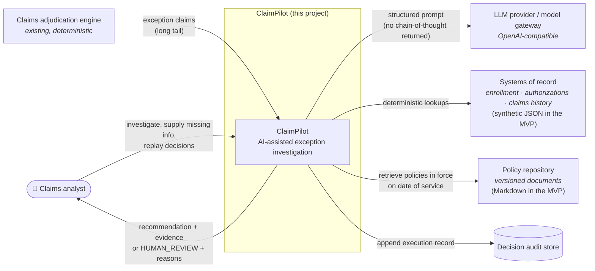

---

## 2. Component view

Arrows show *uses / depends on*. The workflow is the only component that knows the order of steps. Tools, retrieval and the LLM client don't depend on one another.

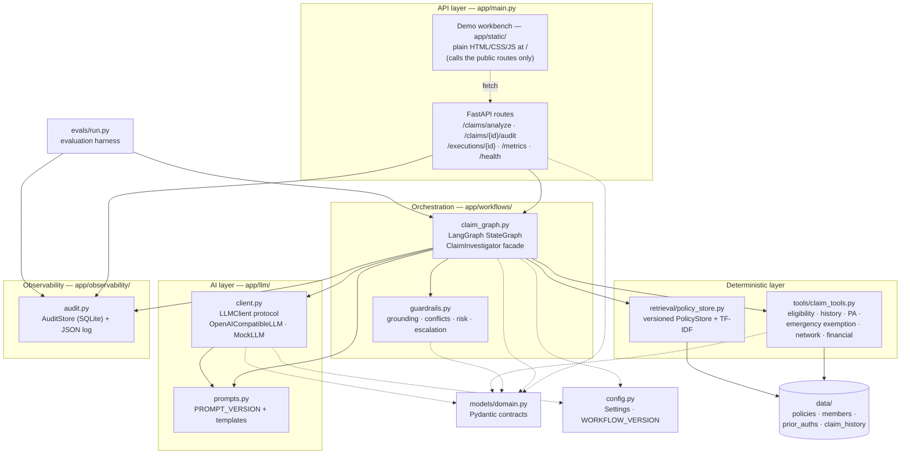

---

## 3. Domain model (UML class diagram)

The Pydantic contracts in `app/models/domain.py`. `ClaimDecision` is what the API returns. `ExecutionRecord` is what the audit stores, and it is a superset that includes versions, the routing trail and the LLM's own opinion.

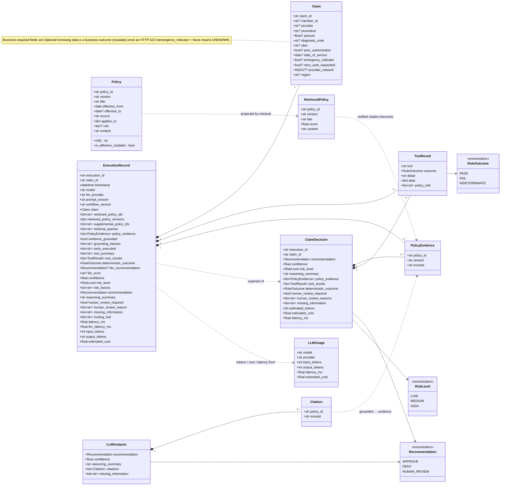

---

## 4. Service classes (UML class diagram)

The behaviour-carrying classes. Dependencies are injected into `build_graph` (LLM, policy store, audit store, settings). That injection is what lets tests swap in `MockLLM` or `ScriptedLLM` and an in-memory audit store without mocking frameworks.

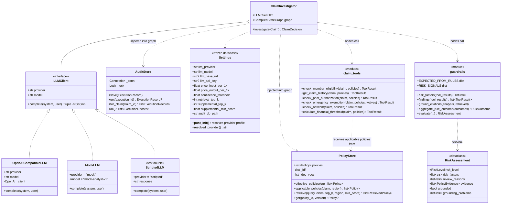

---

## 5. Workflow state machine (LangGraph)

`app/workflows/claim_graph.py` (`WORKFLOW_VERSION = claim-investigation-wf/1.2.0`). There are two decision points, and both are pure functions of the state:
- `after_validation` short-circuits to a human when the claim can't even be identified;
- `human_review_router` sends the claim to a human if **any** guardrail produced a reason.

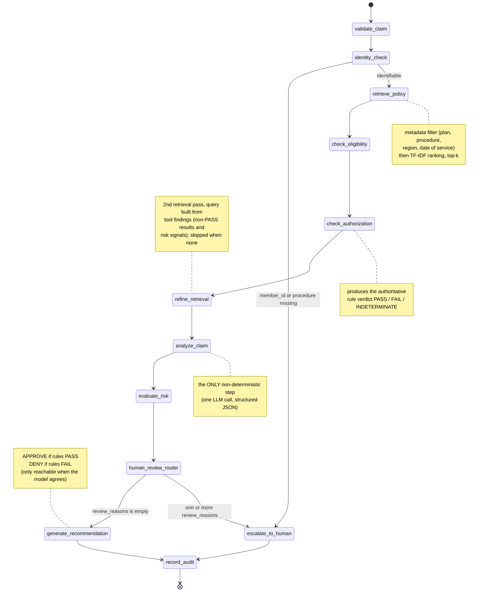

### State that flows through the graph (`ClaimState`)

Fields marked ⊕ use an additive reducer: each node *appends* to them, so the routing trail and tool results build up across nodes.

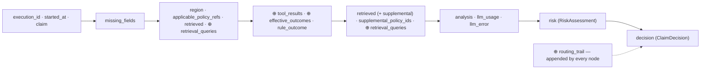

---

## 6. Analyze request (UML sequence)

A complete `POST /claims/analyze` for a claim that passes all guardrails.

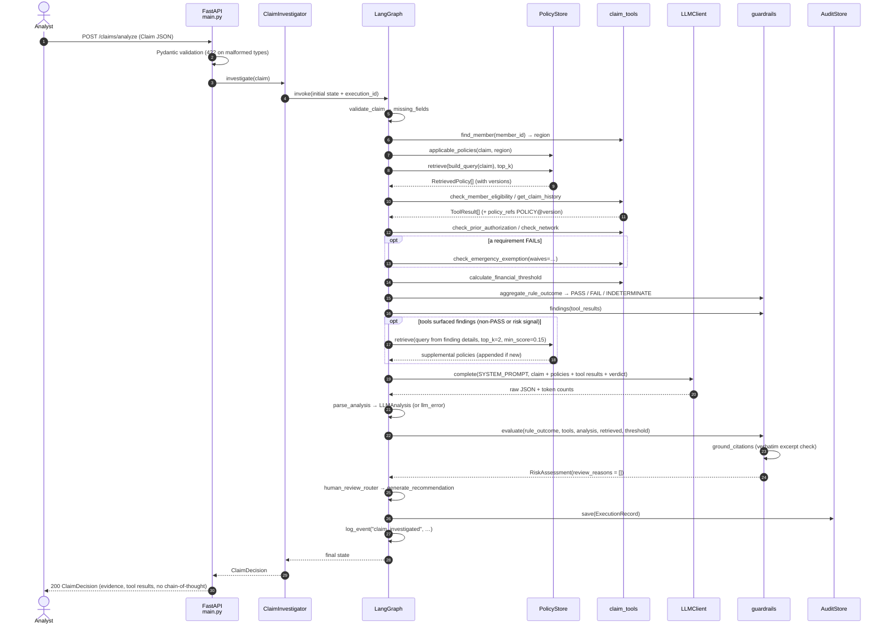

---

### Live progress (same endpoint, streamed)

When the client sends `Accept: application/x-ndjson`, the route runs the same graph with `graph.stream(..., stream_mode="updates")`. It emits one line per completed node, then the decision. The demo UI uses this to light up each step as it really completes. Every other client still gets the single JSON `ClaimDecision`.

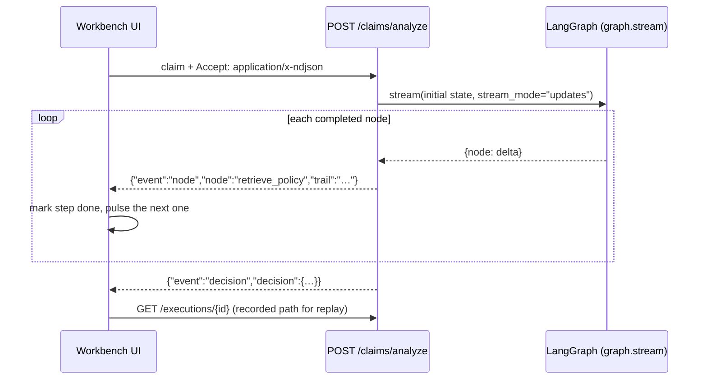

---

## 7. Deterministic rule engine (UML activity)

What `check_eligibility` and `check_authorization` do together. The key design choices:
- **unknown is not the same as no**;
- **disagreeing policies stop the automation**;
- **an exemption's outcome replaces the failed requirement**.

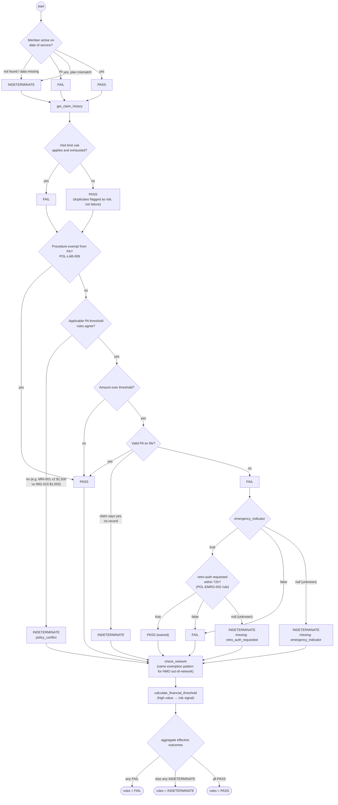

---

## 8. Guardrails & escalation decision (UML activity)

`guardrails.evaluate()` doesn't stop at the first trigger. It collects **every** reason, so the analyst sees the full picture. Routing then comes down to one question: *is the list empty?* A final safety invariant is defence in depth: even if a future change forgot to add a reason, a HIGH-risk, INDETERMINATE or ungrounded case can never become an autonomous decision. `tests/test_guardrails.py::test_safety_matrix_no_combination_lets_the_model_override_rules` checks every combination.

```mermaid
flowchart TD
    in([rule_outcome + tool_results + LLMAnalysis]) --> r1

    r1{Missing data?<br/>claim fields · tool-detected · model-detected} -- yes --> a1["+ 'Required information is missing: …'"]
    r1 -- no --> r2
    a1 --> r2

    r2{Rule verdict INDETERMINATE?<br/>or tool INDETERMINATE not explained<br/>by missing data?} -- yes --> a2["+ 'Deterministic rule verdict is INDETERMINATE'<br/>+ '… could not reach a deterministic result'"]
    r2 -- no --> r3
    a2 --> r3

    r3{Risk factors?<br/>high value · duplicate · policy conflict} -- yes --> a3["+ 'HIGH risk: …'"]
    r3 -- no --> r4
    a3 --> r4

    r4{LLM output valid?} -- no --> a4["+ 'LLM analysis unavailable or invalid; falling back…'"]
    r4 -- yes --> r5
    a4 --> done

    r5{Every citation retrieved,<br/>≥ 5 words AND verbatim in policy text?} -- no --> a5["+ 'Ungrounded citation (possible hallucination)'"]
    r5 -- yes --> r6
    a5 --> r6

    r6{At least one verified citation?} -- no --> a6["+ 'not supported by any verifiable citation'"]
    r6 -- yes --> r7
    a6 --> r7

    r7{confidence ≥ 0.80?} -- no --> a7["+ 'Model confidence X below threshold'"]
    r7 -- yes --> r8
    a7 --> r8

    r8{LLM recommendation vs rules} -- "LLM = HUMAN_REVIEW,<br/>rules decisive" --> a8["+ 'model requested review (honored)'"]
    r8 -- "LLM contradicts rules" --> a9["+ 'model cannot override business rules'"]
    r8 -- agree --> done
    a8 --> done
    a9 --> done

    done{review_reasons empty?}
    done -- yes --> inv{"Safety invariant:<br/>HIGH risk, INDETERMINATE<br/>or not grounded?"}
    inv -- yes --> ai["+ 'Safety invariant: autonomous decision blocked'"] --> hr
    inv -- no --> ok(["generate_recommendation<br/>APPROVE / DENY from rules"])
    done -- no --> hr(["escalate_to_human<br/>HUMAN_REVIEW + all reasons"])

    style a9 fill:#fde2e2,stroke:#c0392b
    style a5 fill:#fde2e2,stroke:#c0392b
    style hr fill:#fff4d6,stroke:#b7791f
    style ok fill:#e3f6e8,stroke:#2f855a
```

### Risk level derivation

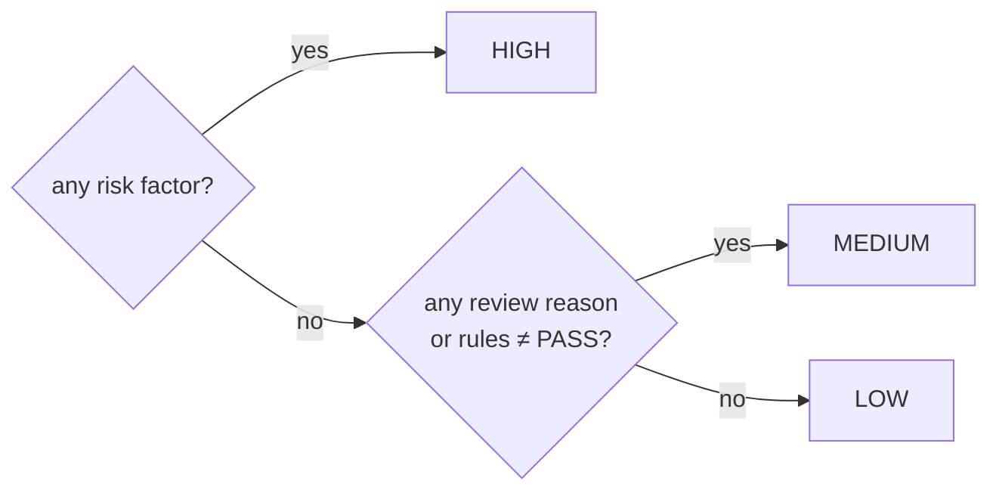

---

## 9. Ambiguous claim lifecycle (UML sequence)

This is the scenario the demo is built around. The system refuses to guess and names the exact missing fact. Once the analyst supplies it, the rerun produces a different decision with its own evidence. Each run is a separate, replayable execution.

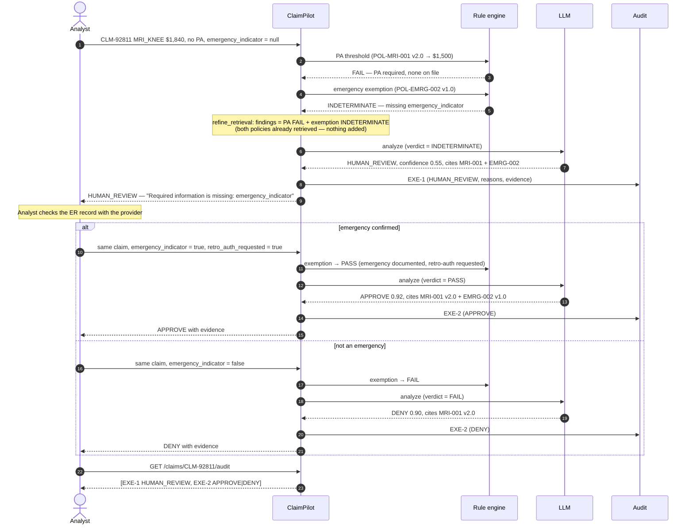

---

## 10. Decision replay (UML sequence)

`GET /executions/{id}` answers *"how was this decision made?"* without exposing chain-of-thought. The replay returns only what the system actually used: evidence, tool results, versions and routing.

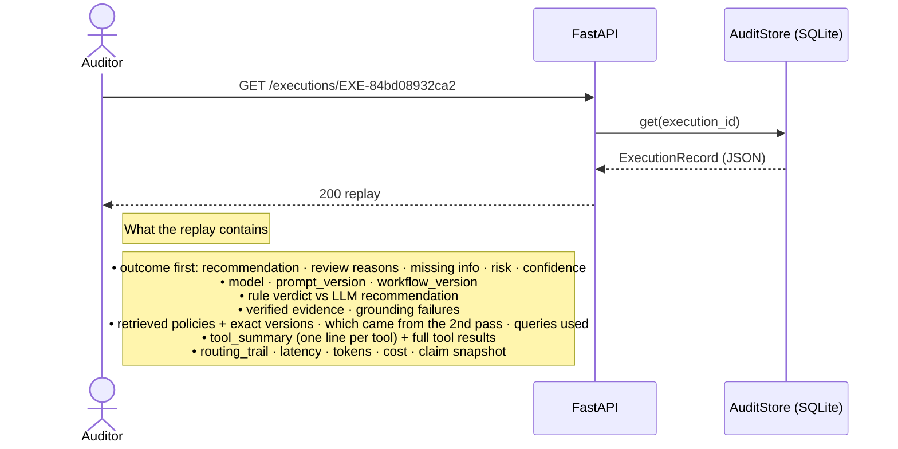

---

## 11. Policy versioning timeline

Policies are chosen by the **date of service**, not the date of analysis. A $1,840 knee MRI needs no PA in October 2025 (v1.0, threshold $2,000) but does need one in September 2026 (v2.0, threshold $1,500). The regional addendum overlaps v2.0 from March 2026, which creates the deliberate conflict case.

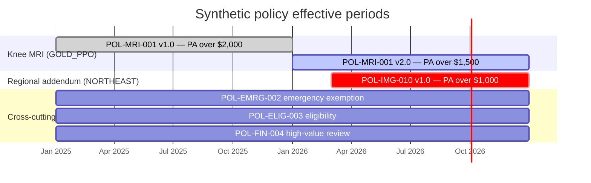

*Open-ended policies (no `effective_to`) are drawn to the end of 2026 for readability.*

---

## 12. Data model (ER)

The policy file is the single source of truth for **both** audiences. The prose goes to the LLM, and the `rule` block goes to the deterministic tools. The audit table stores the full record as JSON, indexed by claim.

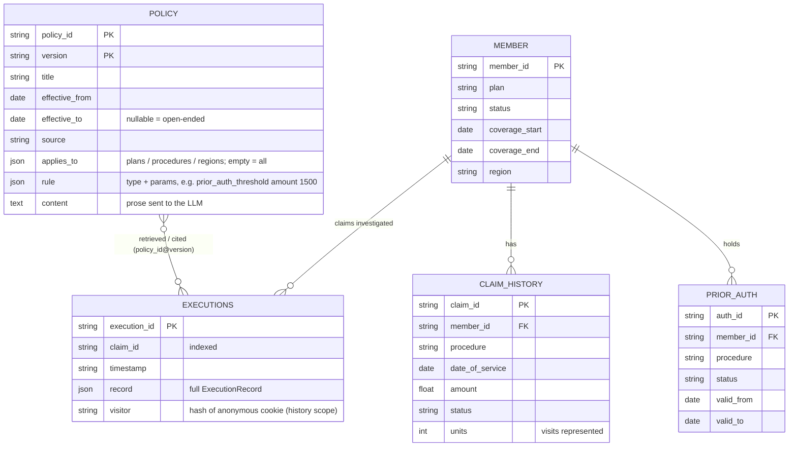

---

## 13. Deployment view

### MVP (as built)

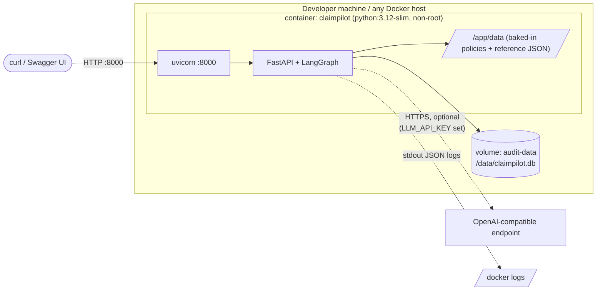

### Target production shape (not built — see README "What I would change for production")

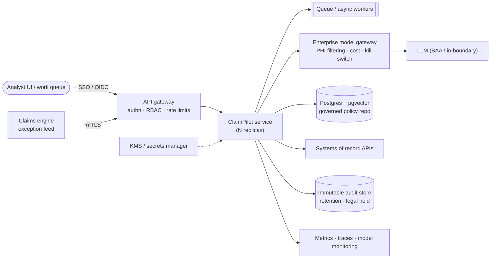

---

## 14. Evaluation pipeline

`python -m evals.run` runs each case through the **same** workflow the API uses, then reads the audit record back. Metrics are computed from what the system actually recorded, not from what the harness thinks it sent. `--provider deepseek|groq|openai` runs the identical pipeline against a real model and refuses to run without that provider's key.

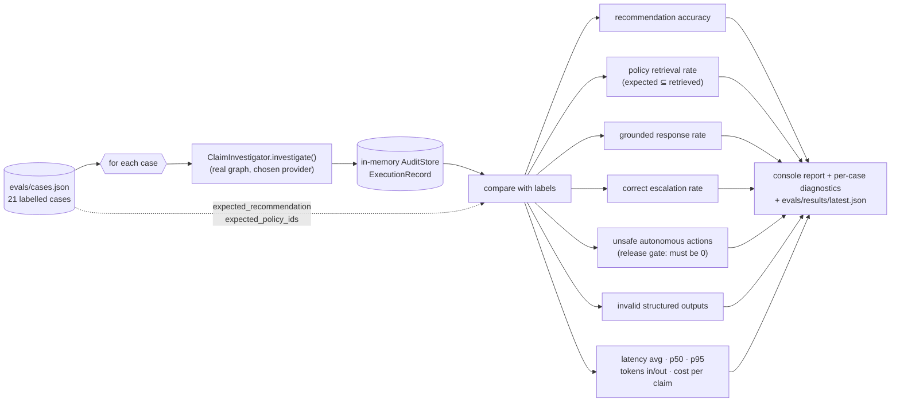
