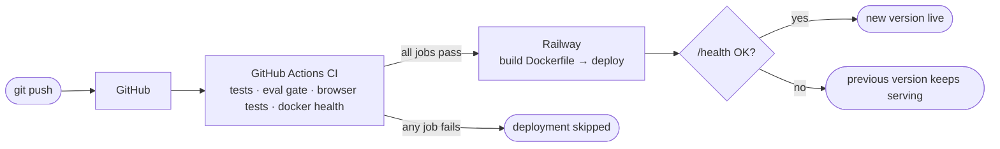

# Deploying ClaimPilot

ClaimPilot ships as **one container**: API, demo UI and evaluation snapshot. The same `Dockerfile` runs locally, on Railway and on Cloud Run. The container listens on `$PORT` when the platform provides one, and on 8000 otherwise.

## Pipeline



- **CI** (`.github/workflows/ci.yml`) runs on every push and pull request:
  - the pytest suite;
  - the evaluation suite with `--gate all`, which fails the build on any unsafe autonomous action or failed case;
  - the Playwright UI tests;
  - a Docker build that must start on a platform-provided `PORT` and report healthy.
- **Railway** deploys `main` automatically, but with **Wait for CI** enabled it holds each deployment until every CI job has passed. A failed run skips the deployment.
- **`railway.json`** keeps the platform settings in the repository: Dockerfile builder, `/health` health check, restart on failure. Railway switches traffic only after the health check passes.

## Railway (primary)

One-time setup, about 10 minutes, in the Railway dashboard:

1. **New Project → Deploy from GitHub repo →** `jefersonbraga/ClaimPilot`. Railway detects `railway.json` and builds the `Dockerfile`.
2. **Service → Variables:** add the provider and its key. Keys live only here, never in the repository.

   | Variable | Value |
   |---|---|
   | `LLM_PROVIDER` | `deepseek` (or `groq`) |
   | `DEEPSEEK_API_KEY` | your DeepSeek key |
   | `GROQ_API_KEY` | optional: your Groq key; enables the model picker in the UI |
   | `DAILY_LLM_BUDGET_USD` | `1.00` |
   | `RATE_LIMIT_PER_MINUTE` | `10` |
   | `DAILY_MAX_ANALYSES` | `300` |

   Without a key the app still runs, on the deterministic mock model. Every provider with a key appears in the UI's *Model* picker, with `LLM_PROVIDER` as the default. Budget and rate limits apply to the total across providers.
3. **Service → Settings → Source:** branch `main`, and turn on **Wait for CI**.
4. **Service → Settings → Networking → Generate Domain.** This is the public URL to put at the top of the README.
5. Keep **one replica**, which is the default. The rate-limit and budget counters live in memory.

After that, every push to `main` goes through CI and then to production.

**Cost control, three layers:**
- the app's own limits: per-IP rate limit, daily analysis cap, daily LLM budget, bounded output tokens;
- Railway's usage limit (Workspace → Usage → set a hard limit);
- a small prepaid balance on the LLM provider account.

**Audit data and visitor history (recommended):** the SQLite audit store lives at `/data/claimpilot.db`. Without a volume it resets on every deploy, which also clears each visitor's history. To keep it:
1. **Service → Volumes → Add volume**, mount path `/data`.
2. **Variables:** add `RAILWAY_RUN_UID=0`. The image runs as a non-root user and Railway mounts volumes as root.

For real use, move the audit to a managed database with retention controls.

## Google Cloud Run (alternative)

Scales to zero, so it costs almost nothing when idle. It needs the gcloud CLI and a GCP project with billing enabled.

```bash
# the key goes to Secret Manager: never into the repo, the image or shell history
read -s KEY && printf %s "$KEY" | gcloud secrets create deepseek-key --data-file=- && unset KEY

gcloud run deploy claimpilot --source . --region us-central1 \
  --allow-unauthenticated --max-instances 1 --memory 512Mi \
  --set-env-vars LLM_PROVIDER=deepseek,DAILY_LLM_BUDGET_USD=1 \
  --set-secrets DEEPSEEK_API_KEY=deepseek-key:latest
```

- `--max-instances 1` keeps the in-memory limits global.
- Cloud Run injects `PORT` (8080), and the container honours it.
- To automate it, add a deploy job to the CI workflow using `google-github-actions/auth` with Workload Identity Federation (no JSON keys), gated on the `tests` job.

## Local

```bash
docker compose up --build        # http://localhost:8000
```
